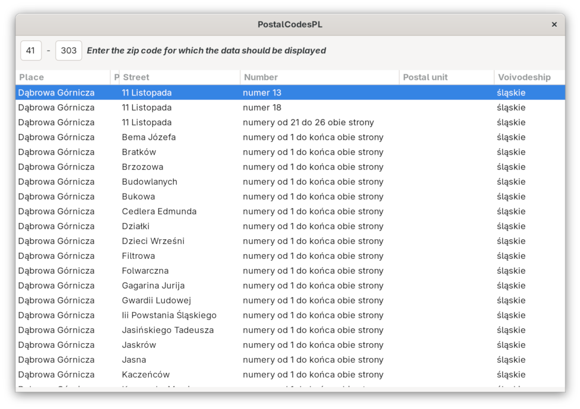
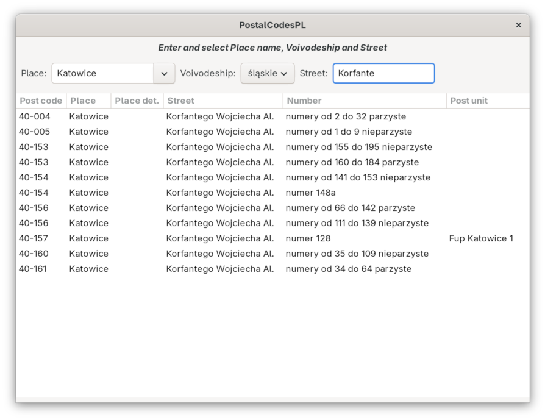

# PostalCodesPL

Database with Polish postal codes.

This project contains an SQLite database file with details of Polish postal codes
(city names, street names, voivodeship info).
The package contains examples in C and Python showing how to use the database.

## Requirements

 * SQLite 3

OS:

 * GNU/Linux
 * Windows

### Requirements (C examples)

 * GCC

### Requirements (Python examples)

 * Python 3
 * GTK+ 3

## PostalCodesPL (polski)

Baza danych polskich kodów pocztowych.

Jest to baza danych SQLite zawierająca informacje o polskich kodach
pocztowych - kody oraz dane o miejscowościach i ulicach przypisanych
do tych kodów.
W paczce są przykładowe zastosowania bazy w Pythonie i C.
Za pomocą programu codes1 (codes1.py) po wpisaniu kodu pocztowego
zostają wyświetlone wszystkie informacje o tym kodzie.
W programie codes2 (codes2.py) można wyszukać kod pocztowy wybranej
miejscowości, województwa i ulicy.
W programie postc (postc.c) można przeglądać informacje o kodach
pocztowych podając kod pocztowy lub nazwę miejscowości.

## Copyright and license

Copyright (C) 2016-2019 Michal Babik

This program is free software: you can redistribute it and/or modify
it under the terms of the GNU General Public License as published by
the Free Software Foundation, either version 3 of the License, or
(at your option) any later version.

This program is distributed in the hope that it will be useful,
but WITHOUT ANY WARRANTY; without even the implied warranty of
MERCHANTABILITY or FITNESS FOR A PARTICULAR PURPOSE.  See the
GNU General Public License for more details.

You should have received a copy of the GNU General Public License
along with this program.  If not, see <https://www.gnu.org/licenses/>.
